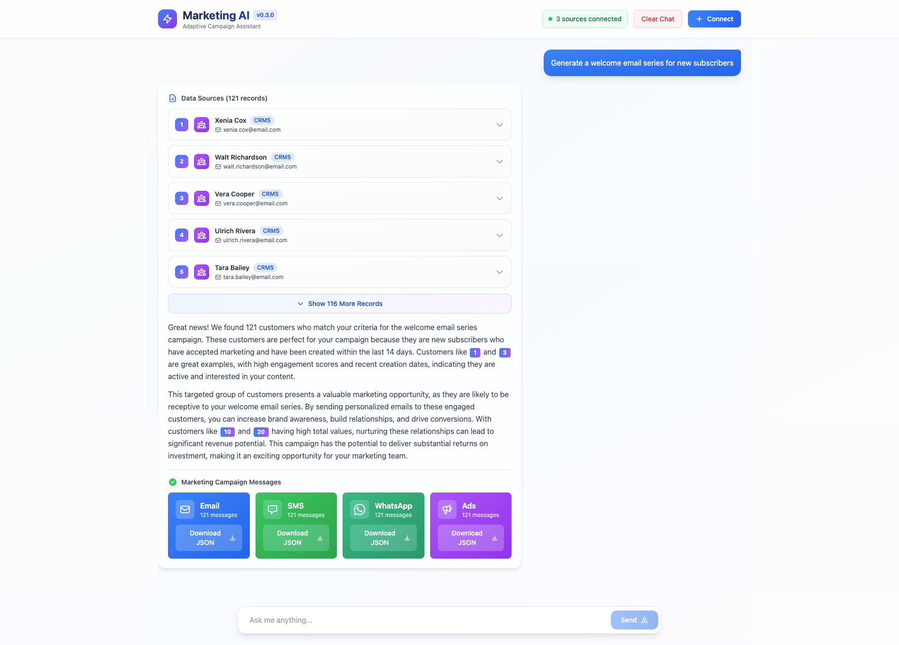

# Adaptive Marketing AI - Full Stack Application

🚀 **Live Demo**: [https://adaptive-marketing-ai.vercel.app](https://adaptive-marketing-ai.vercel.app)  
📚 **API Documentation**: [https://adaptive-marketing-ai-backend.vercel.app/docs](https://adaptive-marketing-ai-backend.vercel.app/docs)

An intelligent marketing AI engine that connects to multiple platforms to generate targeted campaign strategies and provide natural language insights across customer touchpoints.

## 🎯 Description

This full-stack application combines the power of AI with multi-source customer data to create an adaptive marketing assistant. The system integrates data from various sources (Shopify, Website Analytics, CRM), normalizes it into a unified customer schema, and uses AI to generate personalized marketing campaigns and provide strategic insights.

The AI assistant specializes in marketing campaign generation, customer segmentation, and cross-channel strategy recommendations, making it an ideal tool for marketing teams looking to leverage data-driven insights.

### Data Flow
1. **Data Sources** → Raw customer data from Shopify, Website, CRM
2. **Normalization** → Unified customer schema with marketing-specific fields
3. **AI Processing** → Contextual campaign generation and customer analysis
4. **Real-time Interface** → Streaming responses with actionable insights

### Data Sources:
- 50 Shopify customers (e-commerce data)
- 50 Website visitors (analytics data)  
- 50 CRM contacts (sales pipeline data)

## 📈 Improvements & Future Enhancements

### Current Architecture Benefits
- **Serverless-Ready**: Designed for Vercel deployment without background workers
- **Unified Data Model**: Single customer schema across all sources
- **AI Context Management**: Conversation memory for better recommendations

### Potential Improvements

#### 🔄 Enhanced Synchronization
- **Celery Integration**: Could implement sync API with Celery for more robust background processing
- **Real-time Webhooks**: Direct integration with source APIs for instant updates
- **Conflict Resolution**: Advanced merge strategies for duplicate customer data

#### 📊 Advanced Analytics Engine
- **Customer Sync Service Enhancement**: Leverage `customer_sync_service.py` for deeper data analysis
- **Predictive Modeling**: Customer lifetime value and churn prediction
- **Behavioral Clustering**: Machine learning-powered customer segmentation
- **Attribution Modeling**: Cross-channel marketing attribution analysis

#### 🔌 Real Data Source Integration
- **Live API Connections**: Currently uses static sample data - easily replaceable with real API integrations
- **Shopify API**: Connect to actual Shopify stores via REST/GraphQL APIs for real-time e-commerce data
- **CRM Integration**: Direct integration with Salesforce, HubSpot, or Pipedrive APIs
- **Website Analytics**: Google Analytics, Adobe Analytics, or Mixpanel integration for real visitor data
- **Webhook Support**: Real-time data updates via webhooks from connected platforms
- **Data Validation**: Enhanced data quality checks and duplicate detection for live data sources

## 🔧 Technical Considerations

**Why Not Celery for Vercel?**
- Vercel's serverless architecture doesn't support persistent background workers
- Current implementation uses Vercel Cron Jobs for scheduled synchronization
- For traditional deployments, the sync API could easily integrate with Celery for more robust task management

**Analytics Engine Potential:**
- The `customer_sync_service.py` contains rich normalization logic that could be extended
- Additional analytics could include cohort analysis, customer journey mapping, and predictive insights
- Machine learning models could be trained on the unified customer data for advanced segmentation
