# Adaptive Marketing AI - Detailed Architecture

## AI Agent Orchestra & External Services - Complete Flow

```mermaid
graph TB
    %% ============================================
    %% ENTRY POINT & USER INTERFACE
    %% ============================================
    User([👤 User Query<br/>Natural Language])
    Frontend[🖥️ Frontend<br/>React App<br/>:3000]
    
    %% ============================================
    %% API GATEWAY LAYER
    %% ============================================
    subgraph API_Gateway ["🌐 API Gateway Layer"]
        ChatRoute["/api/chat/stream<br/>FastAPI Route<br/>SSE Endpoint"]
        ChatService["💬 Chat Service<br/>Stream Orchestration"]
    end
    
    %% ============================================
    %% AI AGENT ORCHESTRA - CORE SYSTEM
    %% ============================================
    subgraph Orchestra ["🎭 AI Agent Orchestra"]
        direction TB
        
        %% Central Coordinator
        Orchestrator["🎯 Orchestrator Service<br/>Master Coordinator<br/>10 Max Iterations"]
        
        %% Stream Communication Hub
        StreamService["📡 Stream Service<br/>SSE Message Queue<br/>Real-time Updates"]
        
        %% Specialized AI Agents
        subgraph Agents ["🤖 Specialized AI Agents"]
            direction LR
            
            Paraphrase["🔄 Paraphrase Agent<br/>━━━━━━━━━━━<br/>Context Enhancement<br/>Chat History Analysis"]
            
            Manager["🧭 Manager Agent<br/>━━━━━━━━━━━<br/>Query Router<br/>Intent Classifier<br/>Confidence: 0-1"]
            
            QueryGen["⚙️ Query Generator<br/>━━━━━━━━━━━<br/>SQL Synthesizer<br/>Natural→SQL<br/>Learning Loop"]
            
            Validator["✅ Validator Agent<br/>━━━━━━━━━━━<br/>SQL Execution<br/>Confidence Check<br/>Threshold: 0.7"]
            
            Analyst["📊 Business Analyst<br/>━━━━━━━━━━━<br/>Result Interpreter<br/>Insight Generator"]
            
            Marketing["📢 Marketing Agent<br/>━━━━━━━━━━━<br/>Campaign Creator<br/>Multi-channel Messages"]
        end
        
        %% Data Access Layer
        subgraph DataAccess ["💾 Data Access Layer"]
            ChatRepo["Chat Repository<br/>Historical Context"]
            CustomerRepo["Customer Repository<br/>Unified Customer Data"]
        end
    end
    
    %% ============================================
    %% EXTERNAL SERVICES & DATA
    %% ============================================
    subgraph External ["☁️ External Services"]
        direction TB
        
        OpenAI["🧠 OpenAI API<br/>━━━━━━━━━━━<br/>GPT-4 Models<br/>7 LLM Calls/Query<br/>Streaming Enabled"]
        
        Database[("🗄️ PostgreSQL<br/>━━━━━━━━━━━<br/>Customer Table<br/>Chat History<br/>Learning Data")]
        
        DataSources["📦 Data Sources<br/>━━━━━━━━━━━<br/>Static JSON Files<br/>• shopify_customers.json<br/>• website_customers.json<br/>• crm_customers.json<br/>(50 customers each)"]
        
        SyncService["🔄 Sync Service<br/>━━━━━━━━━━━<br/>Schema Normalization<br/>Unified Customer Model"]
    end
    
    %% ============================================
    %% DECISION NODES
    %% ============================================
    D1{{"🔀 Manager Decision<br/>━━━━━━━━━━━<br/>SQL vs General?"}}
    D2{{"✓ Validation Check<br/>━━━━━━━━━━━<br/>Confidence ≥ 0.7?<br/>Security OK?"}}
    D3{{"🔁 Retry Logic<br/>━━━━━━━━━━━<br/>Iterations < 10?"}}
    D4{{"📢 Campaign Check<br/>━━━━━━━━━━━<br/>Marketing Needed?"}}
    
    %% ============================================
    %% PRIMARY FLOW - ENTRY TO ORCHESTRATOR
    %% ============================================
    User -->|"1️⃣ User Input"| Frontend
    Frontend -->|"2️⃣ HTTP POST<br/>SSE Connection"| ChatRoute
    ChatRoute -->|"3️⃣ Initialize Service"| ChatService
    ChatService -->|"4️⃣ Create Task<br/>QueryRequest"| Orchestrator
    
    %% ============================================
    %% CONTEXT ENHANCEMENT PHASE
    %% ============================================
    Orchestrator -->|"5️⃣ Retrieve History<br/>Limit: 50 messages"| ChatRepo
    ChatRepo -->|"5a. Historical Messages<br/>Previous Context"| Paraphrase
    
    Orchestrator -->|"5b. Enhance Query"| Paraphrase
    Paraphrase <-->|"6️⃣ LLM Call #1<br/>Context Analysis<br/>Temp: 0.7"| OpenAI
    Paraphrase -->|"7️⃣ Enhanced Query<br/>or Original"| Manager
    
    %% ============================================
    %% QUERY ANALYSIS & ROUTING
    %% ============================================
    Manager <-->|"8️⃣ LLM Call #2<br/>Intent Classification<br/>Confidence Scoring"| OpenAI
    Manager -->|"9️⃣ Route Decision<br/>query_type + reasoning"| D1
    
    %% ============================================
    %% SQL PATH - DATA QUERY FLOW
    %% ============================================
    D1 -->|"🔵 YES: SQL Path<br/>Campaign/Analytics/Data Query"| QueryGen
    QueryGen <-->|"🔟 LLM Call #3<br/>SQL Generation<br/>Schema-Aware"| OpenAI
    QueryGen -->|"1️⃣1️⃣ Generated SQL<br/>+ Explanation<br/>+ Confidence"| Validator
    
    %% Validation & Execution
    Validator -->|"1️⃣2️⃣ Execute Query<br/>PostgreSQL Transaction"| Database
    Database -->|"1️⃣2️⃣a. Result Set<br/>Customer Data"| Validator
    
    Validator <-->|"1️⃣3️⃣ LLM Call #4<br/>Validation Check<br/>Confidence Scoring"| OpenAI
    Validator -->|"1️⃣4️⃣ Validation Result<br/>confidence + is_valid"| D2
    
    %% Success Path
    D2 -->|"🟢 VALID<br/>High Confidence<br/>+ No Security Issues"| Analyst
    Analyst <-->|"1️⃣5️⃣ LLM Call #5<br/>Result Analysis<br/>Business Insights"| OpenAI
    Analyst -->|"1️⃣6️⃣ Business Analysis<br/>Interpreted Results"| D4
    
    %% Failure Path - Retry Loop
    D2 -->|"🔴 INVALID<br/>Low Confidence<br/>or Execution Error"| D3
    D3 -->|"🔄 RETRY<br/>Iteration < 10<br/>+ Feedback"| QueryGen
    D3 -->|"🛑 MAX REACHED<br/>Iteration = 10<br/>Return Best Attempt"| StreamService
    
    %% Store Learning Data
    Validator -.->|"💾 Store Results<br/>Learning Loop"| Database
    QueryGen -.->|"💾 Store Patterns<br/>Historical Success"| Database
    
    %% ============================================
    %% MARKETING CAMPAIGN GENERATION
    %% ============================================
    D4 -->|"🟢 YES<br/>Campaign Required"| Marketing
    Marketing <-->|"1️⃣7️⃣ LLM Call #6<br/>Need Assessment"| OpenAI
    Marketing <-->|"1️⃣8️⃣ LLM Call #7<br/>Message Generation<br/>Multi-channel Content"| OpenAI
    
    Marketing -->|"1️⃣9️⃣ Fetch Customers<br/>by IDs"| CustomerRepo
    CustomerRepo -->|"1️⃣9️⃣a. Query by ID"| Database
    Database -->|"1️⃣9️⃣b. Customer Profiles<br/>source_data JSON"| CustomerRepo
    CustomerRepo -->|"1️⃣9️⃣c. Enriched Data<br/>Full Profiles"| Marketing
    
    Marketing -->|"2️⃣0️⃣ Personalized Messages<br/>Email/SMS/Social/Push"| StreamService
    
    D4 -->|"🔵 NO<br/>Analysis Only"| StreamService
    
    %% ============================================
    %% GENERAL QUERY PATH
    %% ============================================
    D1 -->|"🟡 NO: General Path<br/>Greeting/Help/Off-topic"| Manager
    Manager <-->|"2️⃣1️⃣ LLM Call<br/>Direct Response<br/>Temp: 0.3"| OpenAI
    Manager -->|"2️⃣2️⃣ General Answer<br/>Conversational"| StreamService
    
    %% ============================================
    %% REAL-TIME STREAMING & OUTPUT
    %% ============================================
    StreamService -->|"2️⃣3️⃣ SSE Stream<br/>Message Queue<br/>FIFO Processing"| ChatService
    ChatService -->|"2️⃣4️⃣ Format SSE<br/>data: {json}"| ChatRoute
    ChatRoute -->|"2️⃣5️⃣ HTTP Stream<br/>text/event-stream"| Frontend
    
    Frontend -->|"2️⃣6️⃣ Display Update<br/>React State"| User
    
    %% Save to History
    ChatService -->|"2️⃣7️⃣ Save Conversation<br/>message + response<br/>+ sources + campaigns"| ChatRepo
    ChatRepo -->|"2️⃣7️⃣a. Insert Record"| Database
    
    %% ============================================
    %% CONTINUOUS STATUS UPDATES
    %% ============================================
    Orchestrator -.->|"📊 Status: Processing"| StreamService
    Manager -.->|"📊 Status: Analyzing"| StreamService
    QueryGen -.->|"📊 Status: Generating<br/>Thinking: Iteration N"| StreamService
    Validator -.->|"📊 Status: Validating<br/>SQL Query Display"| StreamService
    Analyst -.->|"📊 Status: Analyzing Results"| StreamService
    Marketing -.->|"📊 Status: Creating Campaign"| StreamService
    
    %% ============================================
    %% DATA INTEGRATION FLOW (BACKGROUND)
    %% ============================================
    DataSources -.->|"🔄 Read JSON Files<br/>On Integration Connect"| SyncService
    SyncService -.->|"🔄 Normalize Schema<br/>Unified Customer Model<br/>source_data preservation"| Database
    
    %% ============================================
    %% STYLING
    %% ============================================
    classDef userStyle fill:#e1f5ff,stroke:#01579b,stroke-width:3px,color:#000
    classDef apiStyle fill:#fff9c4,stroke:#f57f17,stroke-width:2px,color:#000
    classDef agentStyle fill:#f3e5f5,stroke:#4a148c,stroke-width:2px,color:#000
    classDef serviceStyle fill:#e8f5e9,stroke:#1b5e20,stroke-width:2px,color:#000
    classDef externalStyle fill:#ffebee,stroke:#b71c1c,stroke-width:2px,color:#000
    classDef decisionStyle fill:#fff3e0,stroke:#e65100,stroke-width:3px,color:#000
    classDef dataStyle fill:#e0f2f1,stroke:#004d40,stroke-width:2px,color:#000
    
    class User,Frontend userStyle
    class ChatRoute,ChatService apiStyle
    class Paraphrase,Manager,QueryGen,Validator,Analyst,Marketing agentStyle
    class Orchestrator,StreamService serviceStyle
    class OpenAI,Database,DataSources,SyncService externalStyle
    class D1,D2,D3,D4 decisionStyle
    class ChatRepo,CustomerRepo dataStyle
```



---

## 🎯 Architecture Highlights

### **Request Entry → Exit Complete Path**

#### **Path 1: SQL/Campaign Query (Complex)**
```
User → Frontend → ChatRoute → ChatService → Orchestrator
→ ChatRepo (history) → Paraphrase → OpenAI (enhance)
→ Manager → OpenAI (classify) → DECISION: SQL
→ QueryGen → OpenAI (generate SQL)
→ Validator → Database (execute) → OpenAI (validate)
→ [IF INVALID: retry loop max 10x with feedback]
→ [IF VALID]: Analyst → OpenAI (analyze results)
→ DECISION: Marketing needed?
→ [IF YES]: Marketing → OpenAI (need check) → OpenAI (generate campaigns)
   → CustomerRepo → Database (customer data) → Enrich messages
→ StreamService → ChatService → ChatRoute → Frontend → User
→ ChatRepo → Database (save history)
```

#### **Path 2: General Query (Simple)**
```
User → Frontend → ChatRoute → ChatService → Orchestrator
→ ChatRepo (history) → Paraphrase → OpenAI (enhance)
→ Manager → OpenAI (classify) → DECISION: General
→ Manager → OpenAI (direct answer)
→ StreamService → ChatService → ChatRoute → Frontend → User
→ ChatRepo → Database (save history)
```

---

## 🔢 Key Metrics

| Metric | Value | Description |
|--------|-------|-------------|
| **LLM Calls per SQL Query** | 4-7 | Paraphrase(1) + Manager(1) + Generate(1) + Validate(1) + Analyst(1) + Marketing(2) |
| **LLM Calls per General Query** | 3 | Paraphrase(1) + Manager(1) + Response(1) |
| **Max Retry Iterations** | 10 | QueryGenerator ↔ Validator loop |
| **Confidence Threshold** | 0.7 | Minimum for query acceptance |
| **Fallback Threshold** | 0.5 | Used after max iterations |
| **Chat History Limit** | 50 | Messages retrieved for context |
| **Data Sources** | 3 | Shopify, Website, CRM (50 customers each) |
| **SSE Message Types** | 7 | LLM_RESPONSE, AGENT_STATUS, AGENT_THINKING, SQL_QUERY, RETRIEVED_DATA, CHANNEL_MESSAGE, SERVER_ERROR |

---

## 🛣️ Connection Labels Explained

### **Numbered Steps (1️⃣-2️⃣7️⃣)**
- Sequential flow showing request progression
- Each step represents a critical handoff between components

### **Color-Coded Decisions**
- 🔵 **Blue Path**: SQL/Campaign route (data-intensive)
- 🟡 **Yellow Path**: General query route (conversational)
- 🟢 **Green**: Success conditions
- 🔴 **Red**: Failure/retry conditions
- 🔄 **Loop**: Iterative refinement

### **Dotted Lines (-.->)**
- Background processes
- Status updates (non-blocking)
- Data persistence operations
- Learning loop storage

### **Solid Lines (-->)**
- Primary request flow
- Synchronous operations
- Critical path dependencies

---

## 🔄 Feedback Loops

1. **SQL Refinement Loop**: QueryGenerator ↔ Validator (max 10 iterations)
   - Failed validations provide feedback for next attempt
   - Execution errors guide SQL correction
   - Confidence scores determine acceptance

2. **Learning Loop**: Validator/QueryGenerator → Database
   - Successful queries are stored
   - Validation results improve iterative generations

3. **Context Loop**: ChatRepo → Paraphrase → Current Query
   - Historical conversations enhance current understanding
   - Maintains conversational continuity

---

## 🎭 Agent Orchestration Strategy

### **Sequential Agent Chain**
```
Paraphrase → Manager → [SQL: Generator → Validator → Analyst → Marketing]
                    → [General: Manager Direct Response]
```

### **Parallel Operations**
- Status updates stream independently
- Database queries run in transactions
- LLM calls use async/await

### **Error Handling**
- Each agent wrapped in try/catch
- Graceful degradation on failures
- User-friendly error messages via StreamService

---

## 📊 Data Flow Transformations

### **Input**: Natural Language
```
"Find customers who abandoned cart in last week"
```

### **After Paraphrase** (with context)
```
"Find Shopify customers where cart_abandoned_at is within last 7 days and accepts_marketing is true"
```

### **After Query Generator**
```sql
SELECT * FROM customers 
WHERE data_source = 'SHOPIFY' 
  AND (source_data->>'cart_abandoned_at')::timestamp >= NOW() - INTERVAL '7 days'
  AND accepts_marketing = true
LIMIT 100;
```

### **After Validator**
```
confidence: 0.85, is_valid: true, row_count: 12
```

### **After Business Analyst**
```
"Found 12 customers who abandoned their shopping carts in the past week. 
These customers have shown purchase intent but need a gentle reminder..."
```

### **After Marketing Agent**
```json
{
  "email": ["Subject: Complete Your Purchase - 15% Off!"],
  "sms": ["Hi {first_name}, your cart is waiting! Use code COMEBACK15"],
  "social": ["🛒 Don't miss out on your favorites!"]
}
```
